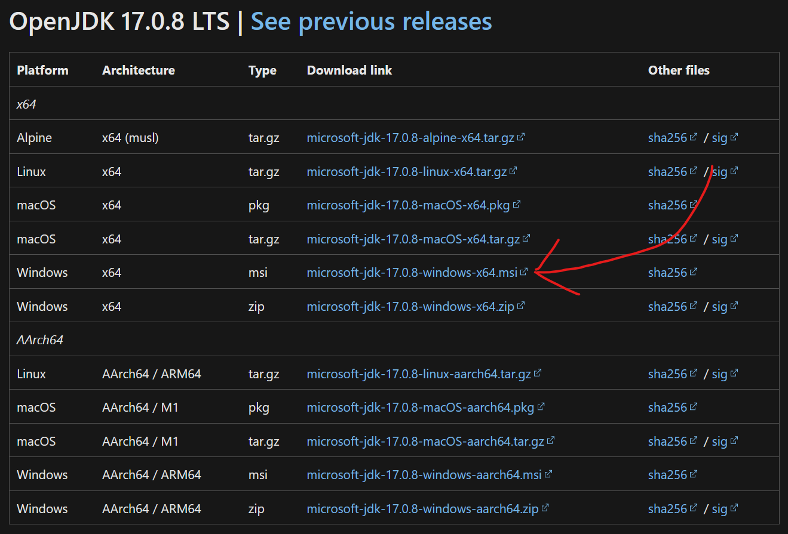

**_Note:_** Java is different from JavaScript!

If you want to play Minecraft, you'll have to install Java. For all of our servers,
you'll need Java 17 or up.

## Download & Install

To use Java, you'll need the Java Runtime Environment (JRE).
OpenJDK includes the JRE, and while it also contains un-needed software for developing
Java applications, you likely won't use it.

Because of its ease-of-use, I recommend downloading OpenJDK from
[here](https://learn.microsoft.com/en-us/java/openjdk/download#openjdk-1708-lts--see-previous-releases).

Most of you will probably want to click the link in the image below:

Once this file is downloaded, open the file and follow along through the installer.
