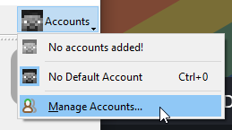
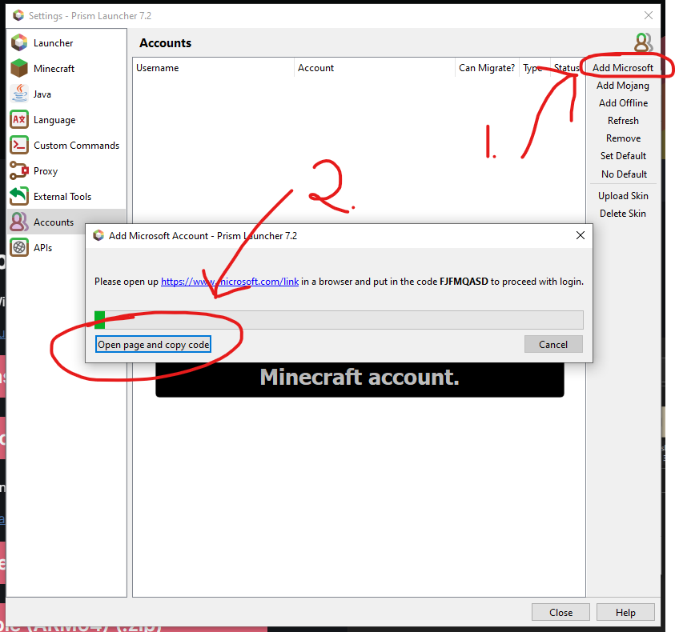
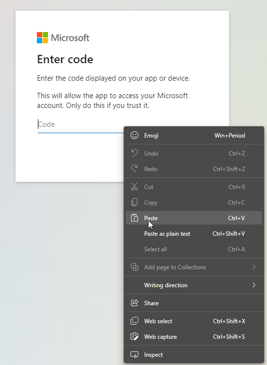

Prism Launcher is a powerful, open-source Minecraft launcher that most of us use in The UwU Cafe server.

## Installing

The Prism Launcher developers have made it very easy to install Prism Launcher. This guide assumes you're
on Windows 10 or Windows 11.

1. Firstly, navigate to [this page](https://prismlauncher.org/download/) and download
   _Microsoft Visual C++ Redistributable 2022 x64_ from the link above the download button, open the downloaded
   file and go through the setup.

2. Once you've finished that, you can go back to the same page and click the
   install button that says `Installer (.exe)`, open the downloaded file, and go through that setup as well.

## First Setup

Open Prism Launcher and follow through the setup process. Once you get to the point where you can select a
Java executable, if you also [installed Java](/guides/install-java), the correct executable should already
be selected. If you know what you're doing, I suggest altering the RAM allocation at the bottom of the
window.

Once you're done with the initial setup, you need to add your account.

1. Navigate to the top right of your screen, click `Accounts` and click `Manage accounts` from the
   dropdown menu.

    

2. Click `Add Microsoft` in the top right of the newly-opened window, then click `Open page and copy code`
   from the popup window.

    

3. Sign in to your Microsoft account and then right click and paste the code from your clipboard.

    

You're done! Now you can play around with Prism Launcher or download a new instance and play on our servers!
